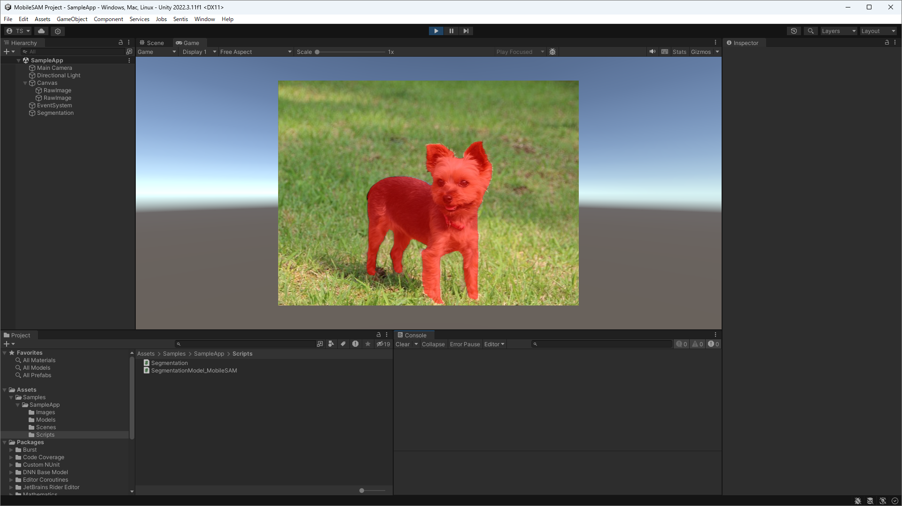

# MobileSAM using HoloLab DNN Packages

## About

This Unity project is sample app of MobileSAM using HoloLab DNN Packages that based on Unity Sentis.  
Please click on the image to show the segmentation area.  

HoloLab DNN Packages implements segmentation class with general segmentation models. However, it doesn't support for Segment Anything Models.  
You can learn how to implement new inference classes for such models that have not been implemented in HoloLab DNN Packages.  

## MobileSAM

MobileSAM consists of two models of encoder and decoder.  
You can export encoder and decoder to ONNX files according to the following repositories.  

* [thislookshard/SamSharp](https://github.com/thislookshard/SamSharp)  

## Environment

These sample work on Unity 2023.2 (Unity 6) or later.  

## License

Copyright &copy; 2024 Tsukasa Sugiura  
Distributed under the [MIT License](https://opensource.org/license/mit/).  

## Contact

* Tsukasa Sugiura  
    * <t.sugiura0204@gmail.com>  
    * <https://sugiura-lab.hatenablog.com/>  

## Reference

* [HoloLab DNN Packages](https://github.com/HoloLabInc/HoloLabDnnPackages)
* [thislookshard/SamSharp](https://github.com/thislookshard/SamSharp)
* [ChaoningZhang/MobileSAM](https://github.com/ChaoningZhang/MobileSAM)
